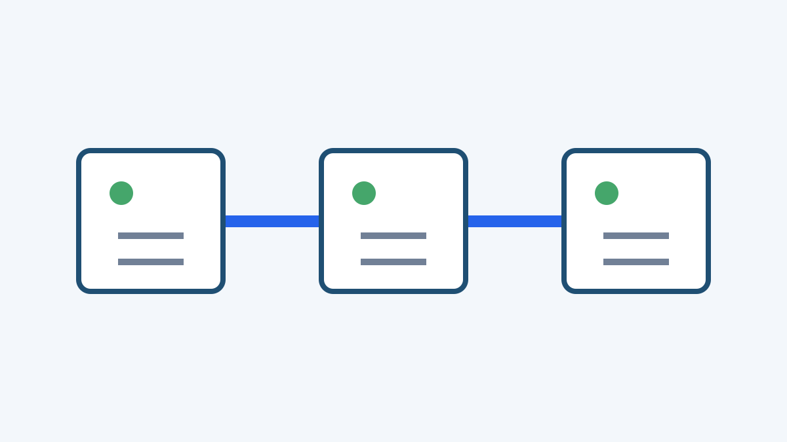
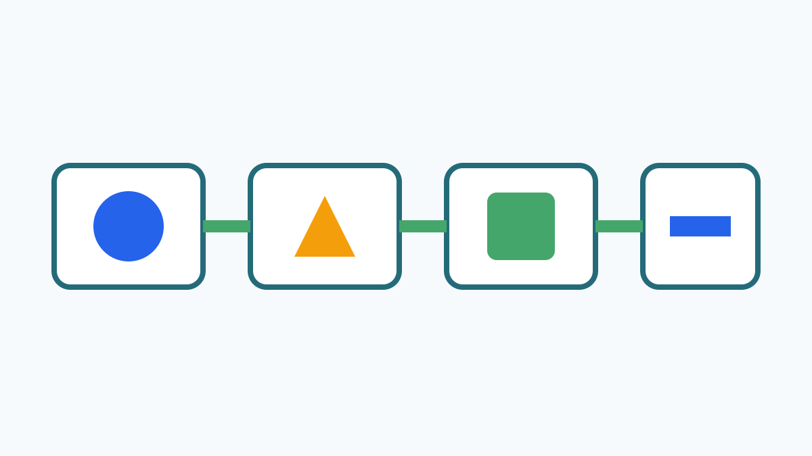

::: slide {layout="cover"}
:::

::: slide {layout="contents"}
:::

::: slide {layout="section"}
## 一、课程建设目标
:::

::: slide {layout="title-content"}
## 面向岗位能力重构课程目标

### 建设主线

课程以智能制造产线的安装、编程、调试与维护岗位为对象，把**安全规范、工艺质量、系统联调和故障诊断**贯穿学习全过程，并以==真实生产任务==作为教学组织主线。学生不仅要完成设备动作，还要能够解释信号流、判断异常来源、记录处置证据，并在团队协作中承担计划、实施、检查和复盘责任。

###

- 对接机电设备装调工、工业机器人系统运维员等岗位典型工作任务。
- 将电气识图、传感检测、PLC 编程、工业网络和机器人应用组织为递进项目。
- 采用任务书、过程记录、作品验收、口头答辩和企业评价相结合的证据链。
- 让课程资源同步服务日常教学、技能竞赛、企业培训和社会技术服务。
- 每轮教学后汇总共性故障、工艺缺陷和学生反思，持续更新案例库与评价量表。
- 对关键安全动作设置教师复核点，确保通电、联机和运动测试均有明确边界。
- 通过跨专业协作任务，让学生理解机械、电气、控制与信息系统之间的接口关系。

::: notes
本页是后续分页候选页。讲解时先说明岗位变化，再用学生作品证据说明课程目标为何必须从“会操作”升级为“能诊断、能协作、能改进”。
:::
:::

::: slide {layout="two-column"}
## 课程体系由岗位任务向学习项目转换

### 岗位任务

分析订单与工艺要求，确认设备节拍、质量标准和安全边界。

### 学习项目

完成智能产线任务导入，绘制工艺流程并分配小组角色。

### 技术能力

- 识读电气与气动图纸。
- 配置 PLC、触摸屏与变频器。
- 完成机器人坐标与节拍联调。

### 评价证据

- 接线与程序版本记录。
- 试运行视频与故障清单。
- 小组答辩和个人反思。

### 持续改进

课程团队根据企业反馈和学生常见错误更新任务难度；最后一个未配对块保留在左栏，右栏保持为空。
:::

::: slide {layout="section"}
## 二、课程内容与实训环境
:::

::: slide {layout="image-text"}
## 真实设备支撑从单机到产线的能力进阶

实训环境按照“元件检测—控制单元—工业网络—机器人工作站—整线联调”组织。学生在同一任务链中反复执行**检查、接线、编程、验证、记录**，逐步形成跨设备诊断能力；教师则通过统一点检表和版本记录保证训练过程可追溯。





::: notes
多张主图共享本页稳定正文和备注，后续每张图形成连续物理页时不改变课程叙事。
:::
:::

::: slide {layout="table"}
## 项目化课程模块与学习成果

### 课程模块、典型任务与验收证据

| 模块 | 典型任务 | 核心知识与技能 | 主要成果 | 评价重点 |
|---|---|---|---|---|
| 安全与规范 | 实训工位风险辨识 | 急停、接地、绝缘与锁定挂牌 | 风险清单 | 边界判断准确 |
| 电气识图 | 识读产线控制原理图 | 主回路、控制回路、端子与线号 | 图纸批注 | 信号关系清楚 |
| 元件检测 | 检测接触器与传感器 | 触点、线圈、量程与状态判断 | 检测记录 | 方法规范完整 |
| 线路安装 | 安装电机启停控制线路 | 选线、压接、布线与自检 | 接线作品 | 工艺整齐可靠 |
| PLC 基础 | 编写顺序控制程序 | I/O 分配、定时计数与互锁 | 程序版本 | 逻辑安全稳定 |
| 触摸屏组态 | 制作设备操作界面 | 变量映射、报警与权限 | 组态工程 | 交互清晰可用 |
| 变频调速 | 配置输送线速度 | 参数设置、通讯与保护 | 参数清单 | 调速平稳安全 |
| 工业网络 | 组建控制设备网络 | 地址规划、诊断与数据交换 | 网络拓扑 | 通讯稳定可查 |
| 机器人基础 | 建立坐标并示教轨迹 | 坐标系、工具与安全区 | 示教程序 | 轨迹合理安全 |
| 视觉检测 | 配置工件质量识别 | 光源、特征与结果通信 | 检测方案 | 识别结果可信 |
| 整线联调 | 联调供料、加工与分拣 | 节拍、互锁、异常恢复 | 运行视频 | 系统协同稳定 |
| 故障诊断 | 排查随机注入故障 | 现象记录、假设验证与复测 | 排故报告 | 路径有据可循 |
| 综合改进 | 优化节拍与质量 | 数据分析、方案比较与复盘 | 改进提案 | 结论可实施 |
:::

::: slide {layout="timeline"}
## 课程建设分阶段实施

| 时间 | 标题 | 说明 |
|---|---|---|
| 第1月 | 岗位调研 | 访谈企业技术人员，整理典型任务、质量标准与安全要求。 |
| 第2月 | 能力分析 | 将工作过程拆解为可观察、可训练、可评价的能力单元。 |
| 第3月 | 项目设计 | 形成由单元控制到整线联调的递进学习项目。 |
| 第4月 | 资源开发 | 编写任务书、工作页、微课、故障卡和评价量表。 |
| 第5月 | 环境改造 | 完成工位标识、设备点检、网络配置和安全复核。 |
| 第6月 | 教师试讲 | 通过集体备课验证任务难度、课时安排和评价证据。 |
| 第7月 | 首轮实施 | 记录学生操作、作品质量、常见错误和课堂节奏。 |
| 第8月 | 企业评价 | 邀请企业导师依据岗位标准评审学生综合作品。 |
| 第9月 | 数据复盘 | 汇总过程证据，识别课程内容和设备条件中的薄弱点。 |
| 第10月 | 资源迭代 | 修订任务难度、故障案例、评分规则和教师提示。 |
| 第11月 | 成果推广 | 面向专业群共享项目资源并开展教师培训。 |
| 第12月 | 质量闭环 | 形成年度诊改报告和下一轮课程建设清单。 |
:::

::: slide {layout="gallery"}
## 实训资源共同构成学习证据链





:::

::: slide {layout="section"}
## 三、教学实施与质量评价
:::

::: slide {layout="code"}
## 产线联调记录采用可审阅的结构化文本

```html
<section class="commissioning-record">
  <header>
    <h1>智能产线联调记录</h1>
    <p>本段是 fenced code 内的无害 HTML/CSS-like 文本。</p>
  </header>
  <style>
    .commissioning-record {
      color: var(--template-owned-color);
      width: 100%;
      background: transparent;
    }
  </style>
  <ol>
    <li>确认急停、保护接地和安全门状态。</li>
    <li>核对 PLC I/O 地址与端子标识。</li>
    <li>检查变频器、伺服与机器人报警。</li>
    <li>先执行单元手动动作，再执行自动循环。</li>
    <li>记录每个工位的启动条件和互锁条件。</li>
    <li>测量空载节拍并保存程序版本。</li>
    <li>注入传感器异常并观察系统响应。</li>
    <li>按现象、假设、验证、处置、复测记录排故过程。</li>
    <li>比较优化前后的节拍、停机次数和作品质量。</li>
    <li>由教师与企业导师共同签署验收意见。</li>
  </ol>
  <footer>
    <p>记录进入课程质量改进资料库。</p>
  </footer>
</section>
```
:::

::: slide {layout="title-content"}
## 多元评价推动教学持续改进

### 评价原则

评价不只看设备是否运行，还要看学生能否说明**为什么这样接、为什么这样改、如何证明问题已经解决**。

###

- 过程评价关注安全动作、工艺规范、协作沟通和记录完整性。
- 作品评价关注功能实现、运行稳定性、故障恢复和现场整理。
- 答辩评价关注技术依据、证据使用、替代方案和迁移能力。
- 企业评价关注岗位适配、质量意识、交付节奏和持续学习能力。
- 课程团队按学期复盘评价数据，把高频失分项转化为新的训练任务。


:::
